# 관통프로젝트: T12S14_Framework_SSAFYHome_강희진_고금강
### 제출일: 2024.11.01

### 참여 페어
- 강희진, 고금강

### 처리된 요구사항 목록
 
|난이도|구현기능|세부|작성여부(O/X)|
|:---:|---|---|:---:|
|기본|메인페이지||O|
|기본|회원관리 페이지|회원정보등록/수정/삭제/검색|O|
|기본|로그인/로그아웃 페이지||O|
|기본|실거래가 검색,결과 페이지|전체검색,상세검색,동별, 아파트별 검색화면|O|
|추가|비밀번호 찾기/사이트맵/메뉴구성||O|
|추가|관심지역 동네 업종 정보, 관심지역 대기오염 정보||X|
|심화|웹사이트 소개/공지사항 관리 화면||O|

 

* 작성된 기능은 반드시 캡쳐되어야 합니다. 
* 추가로 구현한 기능을 표에 추가시키세요.

## 실행화면 캡쳐 

### 부동산 거래 
1. 부동산 이름으로 검색

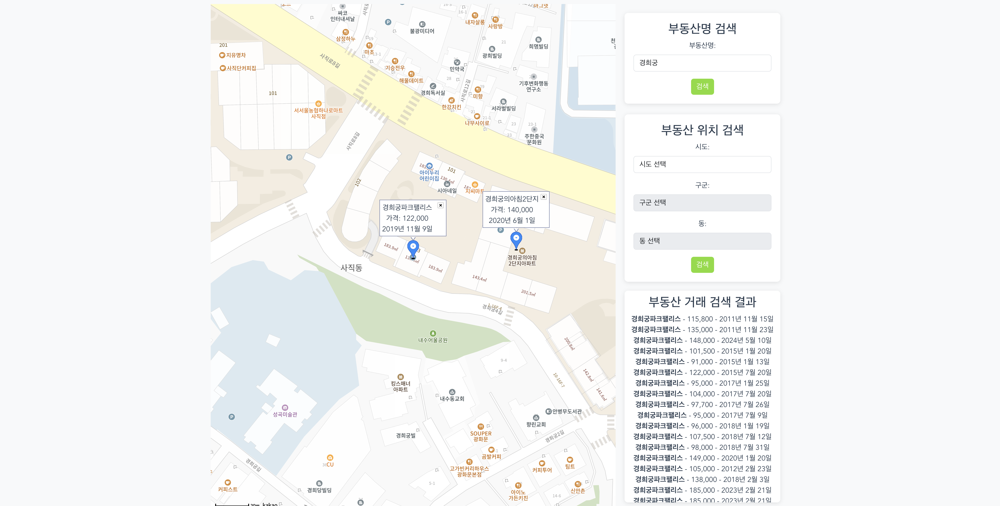

2. 부동산 위치로 검색

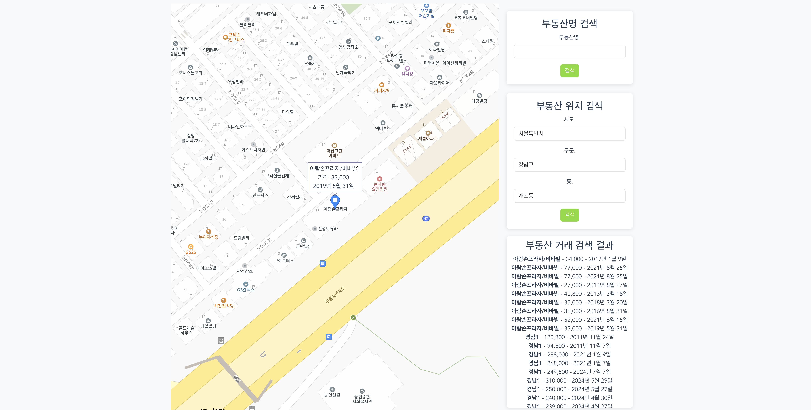

### 회원

1. 회원가입

1-1. 회원가입 성공

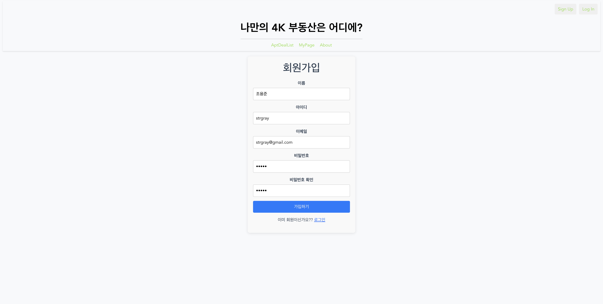

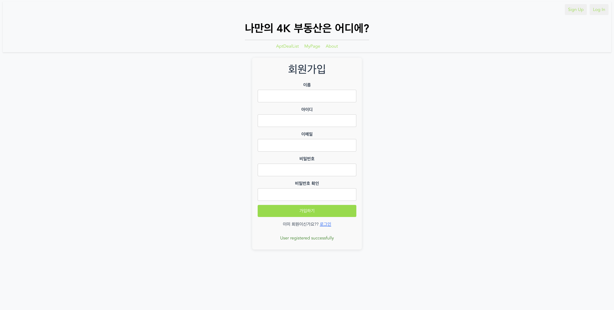

1-2. 회원가입 실패

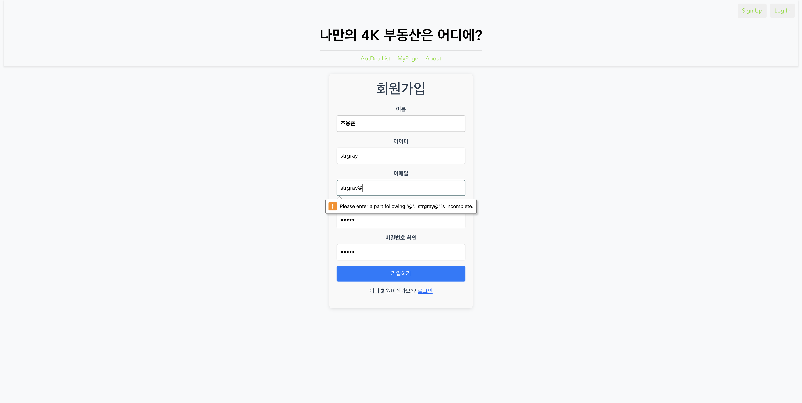

2. 회원 정보 수정

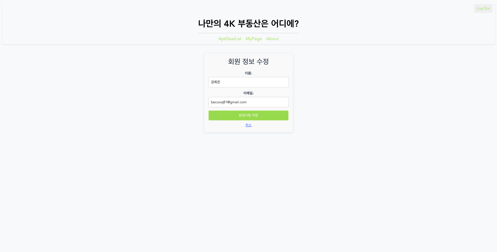

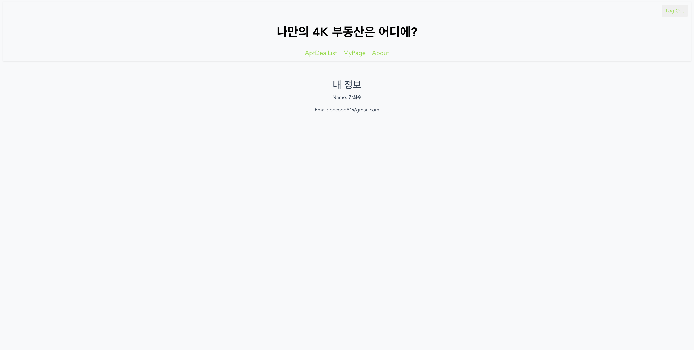

3. 회원 정보 삭제

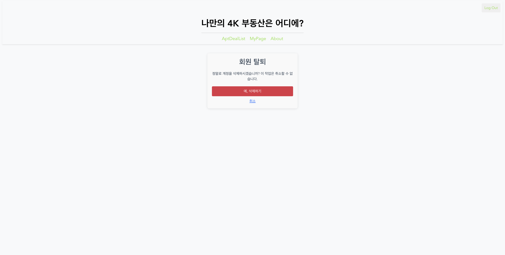
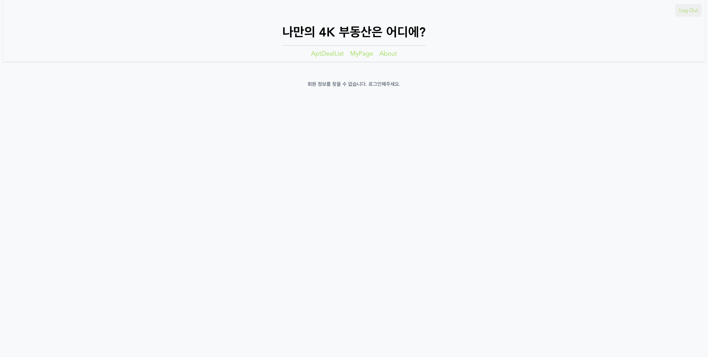

4. 로그인

4-1. 로그인 성공
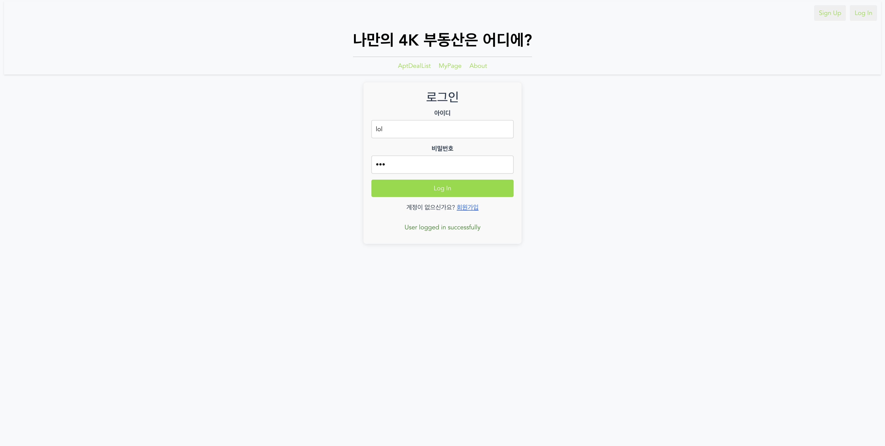

4-2. 로그인 성공시 로그아웃 버튼과 마이페이지 등장
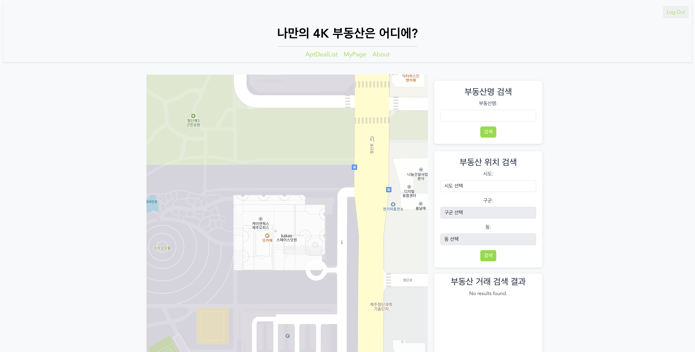

5. 회원 정보 조회

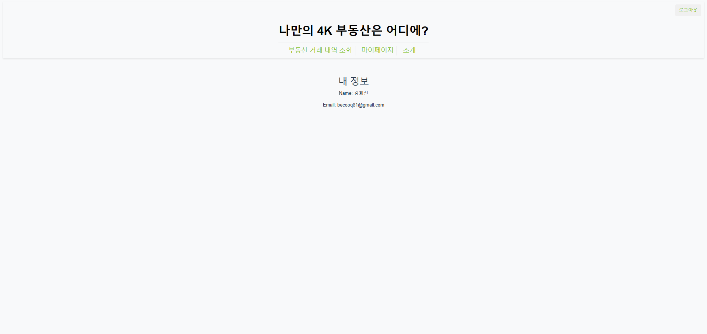

### 웹사이트 소개

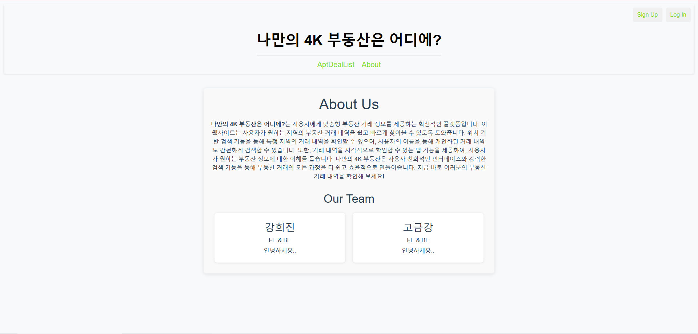

### DB 구축
1. HouseDeal 테이블

2. HouseInfo 테이블

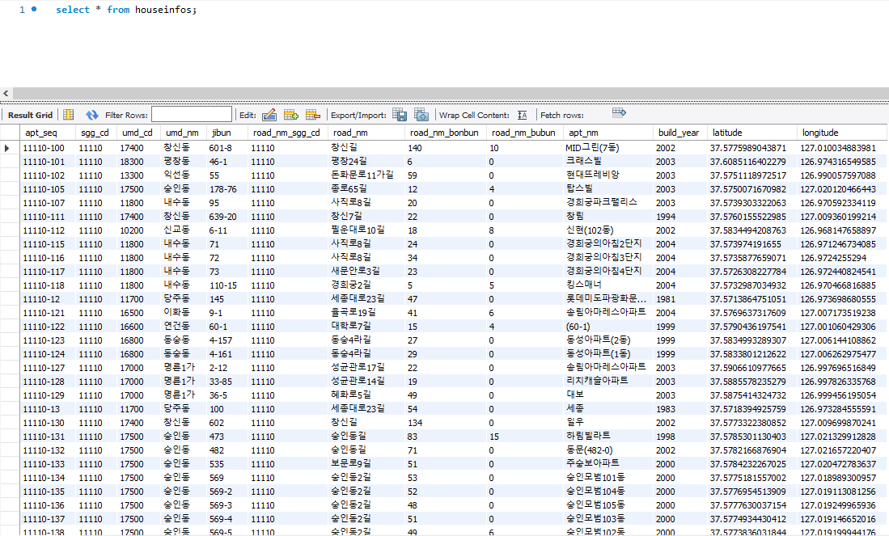

3. DongCode 테이블

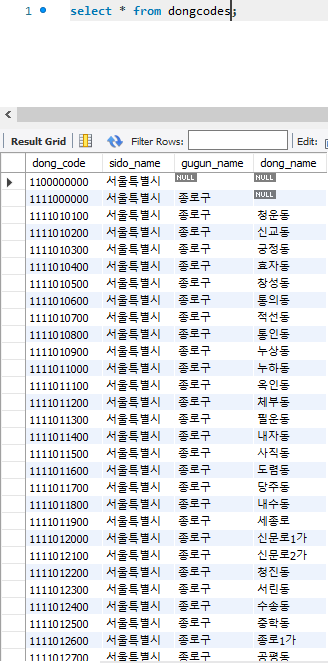

### Class Diagram
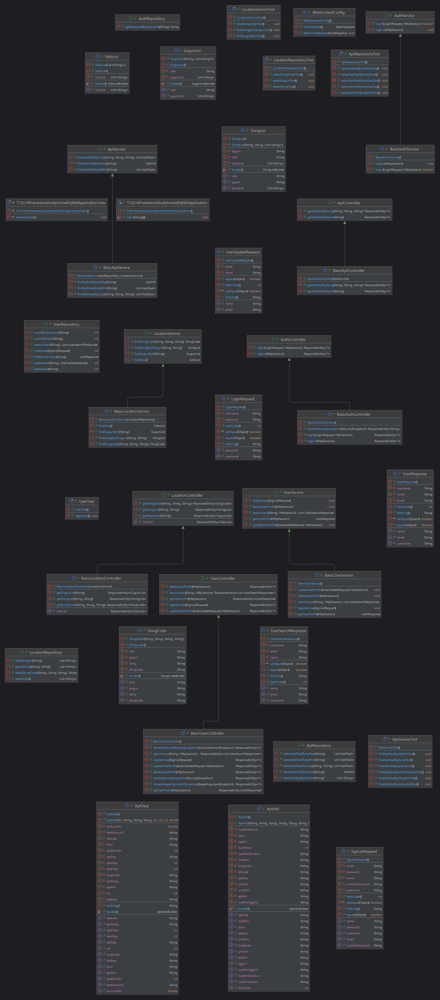

구현 기능: FrontEnd + BackEnd(Controller, Model(Dao, Service, Dto)

구현 기능: 전체 프로그램 동작/오류 없이 전체 동작 1

